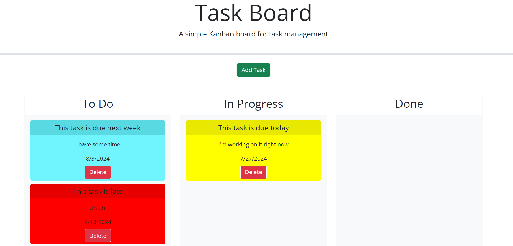

# C5-Task-Board
In this assignment, we create a simple kanban style interface. Features include a bootstrap-based modal, task cards that can dragged between kanban lanes, and peristent memory of the cards' lane locations.

## Screenshot & Project Link

Site Link: https://jvalliswalker.github.io/C5-Task-Board/

## Code References
Below are sources for code I referenced during this project.

#### Bootstrap based modals
* **Purpose:** Create a modal using bootstrap provided code
* **Source:** https://getbootstrap.com/docs/4.0/components/modal/
* **Place(s) Used:** index.html

#### Bootstrap forms & validation
* **Purpose:** Create a bootstrap form and provide field level validation on attempted submission
* **Source:** https://getbootstrap.com/docs/4.0/components/forms/
* **Place(s) Used:** index.html modal, script.js function `validateFormData()`

#### Call function on bootstrap modal closure
* **Purpose:** Allow for clearing of bootstrap form on modal closure, independent of submission button
* **Source:** https://stackoverflow.com/questions/17461682/calling-a-function-on-bootstrap-modal-open
* **Place(s) Used:** script.js function `resetForm()`